# Phoenix Music Platform Technical Roadmap

## Project Overview

Phoenix is a comprehensive music community and ecosystem platform that combines elements of SoundCloud, Bandcamp, Beatport, Spotify, and Facebook into one integrated solution. The platform features a unique cross-genre battle system, multiple account types for different music professionals, and advanced social features.

```mermaid
graph TD
    A[Phoenix Platform] --> B[Core Infrastructure]
    A --> C[Audio Processing]
    A --> D[Battle System]
    A --> E[Social Features]
    A --> F[Account Management]
    A --> G[Analytics & Charts]
    A --> H[Monetization]
    A --> I[Mobile Apps]
    
    B --> B1[Microservices Architecture]
    B --> B2[API Gateway]
    B --> B3[Databases]
    B --> B4[Authentication]
    
    C --> C1[Audio Upload Processing]
    C --> C2[Format Conversion]
    C --> C3[Quality Analysis]
    C --> C4[Genre Classification]
    C --> C5[Stem Separation]
    
    D --> D1[Battle Creation]
    D --> D2[Submissions]
    D --> D3[Voting System]
    D --> D4[Results Calculation]
    D --> D5[Rewards Distribution]
    
    E --> E1[User Profiles]
    E --> E2[Messaging]
    E --> E3[Groups]
    E --> E4[Events]
    E --> E5[News Feed]
    
    F --> F1[Authentication]
    F --> F2[Account Types]
    F --> F3[Subscription Management]
    F --> F4[Permissions]
    
    G --> G1[Data Collection]
    G --> G2[Chart Algorithms]
    G --> G3[Anti-gaming Detection]
    G --> G4[Reporting Dashboard]
    
    H --> H1[Payment Processing]
    H --> H2[Revenue Distribution]
    H --> H3[Battle Entry Fees]
    H --> H4[Marketplace]
    
    I --> I1[iOS App]
    I --> I2[Android App]
    I --> I3[Cross-platform Sync]
    
    classDef infra fill:#e6f7ff,stroke:#1890ff,stroke-width:2px
    classDef audio fill:#f6ffed,stroke:#52c41a,stroke-width:2px
    classDef battle fill:#fff2e8,stroke:#fa8c16,stroke-width:2px
    classDef social fill:#f9f0ff,stroke:#722ed1,stroke-width:2px
    classDef account fill:#e6f7ff,stroke:#1890ff,stroke-width:2px
    classDef analytics fill:#fff1f0,stroke:#f5222d,stroke-width:2px
    classDef monetization fill:#f9f0ff,stroke:#13c2c2,stroke-width:2px
    classDef mobile fill:#f0f5ff,stroke:#2f54eb,stroke-width:2px
    
    class B,D,G,M infra
    class C audio
    class F account
    class E,F social
    class H monetization
    class I mobile
```

## PHASE 1 – Infrastructure Setup & Architecture

[ ] **Infrastructure Design**: Establish complete cloud architecture using AWS/GCP with auto-scaling groups, load balancers, and CDN integration for global distribution of media content. Design the system to handle peak loads during viral battles while maintaining sub-second response times for all user interactions.

[ ] **Containerization Setup**: Implement Docker containerization for all services using Kubernetes orchestration, creating a production-ready environment consistent between development and production. Set up container registries, image management, and automated builds triggered by code commits.

[ ] **CI/CD Pipeline Implementation**: Establish comprehensive CI/CD pipelines using GitLab CI or GitHub Actions with automated testing, security scanning, and deployment. Implement canary releases and blue-green deployments to ensure zero-downtime updates across the microservice architecture.

[ ] **Database Schema Design**: Design and implement database schemas for PostgreSQL with proper indexing strategies, read replicas for scaling, and connection pooling. Set up migration scripts using Alembic for schema versioning and ensure data integrity constraints are properly defined.

[ ] **API Gateway Configuration**: Implement an API gateway using Kong or similar to handle routing, rate limiting, authentication, and request throttling. Configure endpoint documentation with OpenAPI/Swagger specifications for all services and set up monitoring for API performance metrics.

[ ] **Monitoring & Logging Setup**: Deploy comprehensive monitoring stack including Prometheus for metrics collection, Grafana for visualization, and ELK stack for centralized logging. Implement alerting systems for critical issues and performance degradation across all services.

[ ] **Security Framework Integration**: Implement comprehensive security measures including HTTPS/TLS for all communications, JWT-based authentication, OAuth2 for third-party integrations, and input validation to prevent common web vulnerabilities like XSS and SQL injection.

[ ] **Cache Infrastructure**: Create distributed caching layer using Redis with clustering for session management, rate limiting, and frequently accessed data. Implement TTL strategies and write-behind patterns to ensure cache consistency with primary database.

[ ] **Message Queue Setup**: Implement high-throughput message queues using RabbitMQ or Apache Kafka for asynchronous processing of audio uploads, chart calculations, and battle notifications. Configure dead-letter queues for handling failed messages and implement message ordering guarantees where needed.

[ ] **Storage Solution Configuration**: Set up cloud storage solutions including S3-compatible object storage for user uploads, CDN for media delivery, and block storage for temporary processing. Implement proper access controls, lifecycle policies, and backup strategies for all storage tiers.

## PHASE 2 – User Account & Authentication System

[ ] **Multi-Account Authentication System**: Develop flexible authentication system supporting concurrent multiple account types (Fan, DJ, Producer, etc.) with JWT-based token architecture. Implement single sign-on (SSO) capabilities with proper scope handling to ensure users can seamlessly switch between their different account types without re-authentication.

[ ] **Database Seeder Development**: Create comprehensive database seeder scripts to populate the database with initial genres, subscription tiers, battle categories, and other reference data. Implement fixture management for different environment configurations and automated testing data generation with anonymization strategies for production-like test environments.

[ ] **User Model Implementation**: Design and implement robust user models supporting multi-role accounts with proper foreign key relationships and indexing strategies. Create migration scripts for user tables with support for polymorphic relationships to handle different account types efficiently.

[ ] **Account Registration Flow**: Build complete registration flow with email verification, CAPTCHA integration to prevent bot accounts, and progressive profiling for collecting additional user information over time. Implement referral system and social login providers (Google, Facebook, Apple) for reduced friction in user acquisition.

[ ] **Password & Security Management**: Implement password strength requirements, secure password hashing using Argon2 with proper work factor configuration, and account recovery mechanisms. Set up security monitoring for suspicious login attempts including geolocation verification and notification system for unusual access patterns.

[ ] **Subscription Management Engine**: Develop subscription management system handling tier upgrades/downgrades, billing cycles, and payment processing integration with Stripe. Implement entitlement service checking user subscription status across all platform features and handling prorated billing for mid-cycle changes.

[ ] **Permission & Access Control**: Implement RBAC (Role-Based Access Control) system with granular permissions for different account types and features. Create permission service to check user access rights at runtime and implement audit logging for sensitive permission changes to ensure compliance and security.

[ ] **Account Linking & Profiles**: Build system for connecting different account types under a single user profile while maintaining distinct data separation. Implement profile system supporting custom themes, verification badges, and activity status indicators with proper database sharding for high-traffic profile pages.

[ ] **Multi-factor Authentication**: Implement 2FA using TOTP (Time-based One-time Password) with authenticator app support and backup recovery codes. Create security settings page allowing users to manage authentication methods, trusted devices, and login notification preferences.

[ ] **Privacy Settings Framework**: Develop comprehensive privacy settings system with granular controls over profile visibility, data collection preferences, and activity visibility. Implement GDPR-compliant data handling with automated data export functionality and right-to-be-forgotten process integration.

## PHASE 3 – Audio Processing System

[ ] **Audio Upload Pipeline**: Implement robust audio upload pipeline supporting multiple formats (MP3, WAV, FLAC, AIFF) with chunked upload for large files. Set up server-side validation for audio parameters including bitrate, sample rate, and channel count, with immediate error feedback to prevent invalid uploads.

[ ] **Audio Format Conversion**: Build transcoding service using FFmpeg to convert uploaded files into multiple quality tiers (128kbps, 320kbps, lossless) with proper metadata preservation. Implement conversion queue system with progress tracking and retry logic for failed conversions to ensure all uploads are successfully processed.

[ ] **Audio Analysis Engine**: Develop audio analysis system using librosa library to extract tempo, key, BPM, and other metadata for uploaded tracks. Implement feature extraction for similarity matching, genre classification, and content-based recommendations with machine learning models trained on diverse music genres.

[ ] **Stem Separation Service**: Create AI-powered stem separation system using machine learning models to isolate vocals, drums, bass, and other instruments from mixed tracks. Implement batch processing capabilities and resource-efficient scheduling to handle stem requests without impacting platform performance.

[ ] **Audio Quality Assessment**: Implement automated audio quality assessment system detecting clipping, noise, and other audio problems. Create scoring mechanism for technical quality as part of the chart algorithm and provide feedback to artists on improving production quality.

[ ] **Audio Waveform Generation**: Develop waveform generation service producing accurate audio visualizations with different detail levels for track displays and battle interfaces. Implement store-and-forward caching to avoid redundant waveform calculations for commonly accessed tracks.

[ ] **Streaming Service Integration**: Create backend service for integrating with streaming platforms (Spotify, Apple Music, etc.) to distribute content and receive analytics. Implement multi-platform sync ensuring track metadata is consistently updated across all services with proper error handling for partial failures.

[ ] **Audio Search System**: Implement audio search capability using fingerprinting technology to identify tracks even with slightly different metadata. Set up content matching and duplicate detection system to maintain library integrity and provide proper attribution for original creators.

[ ] **Batch Processing Queue**: Design efficient batch processing queue system for audio normalization, loudness standardization, and mastering services. Implement priority handling for premium users and time-based scheduling to minimize resource contention during peak hours.

[ ] **Audio Archive Management**: Create comprehensive archive system managing different audio versions, stems, and derivative works with proper metadata preservation. Implement long-term storage strategies with cost-effective tiered storage solutions for immediate and historical audio assets.

## PHASE 4 – Battle System Core Implementation

[ ] **Battle Management API**: Design and implement comprehensive battle management APIs supporting different battle types (genre clash, skill battles, collaboration challenges). Create request validation system ensuring battle parameters comply with platform rules and checking user eligibility for participation in specific battle types based on their account status.

[ ] **Battle Creation Flow**: Build intuitive battle creation interface allowing users to challenge other artists across genre boundaries. Implement battle configuration system with customizable rulesets, submission deadlines, judging criteria, and stake prizes. Create automated scheduler for managing battle timeline and transition between submission and voting phases.

[ ] **Real-time Battle Dashboard**: Develop battle dashboard showing ongoing battles with live vote counts, timer displays, and participant submission status. Implement WebSocket-based push notifications informing users about battle updates and deadline reminders to maintain high engagement throughout battle lifecycle.

[ ] **Battle Submission System**: Create battle submission system handling audio uploads specific to battle contexts with metadata requirements for submission quality. Implement validation pipeline checking submissions meet battle rules and provide clear feedback to users about any compliance issues requiring correction.

[ ] **Multi-Criteria Voting Engine**: Design sophisticated voting system with weighted categories (creativity, technical skill, genre fusion, overall impression) implementing the specified weighting algorithm. Implement anti-bot measures requiring meaningful engagement before voting and rate limiting to prevent spam voting.

[ ] **Voting Weighting Algorithm**: Develop complex voting weight calculation system considering account type, user ranking, subscription tier, and genre expertise factors. Create voting integrity checks for suspicious patterns and flag potential manipulation attempts for review by human moderators.

[ ] **Battle Results Calculation**: Implement battle results processing engine calculating final scores based on voting patterns and applying multi-factor algorithm. Create comprehensive battle history tracking system storing detailed voting records and battle metadata for analytics and dispute resolution if needed.

[ ] **Battle Reward Distribution**: Design reward distribution system automatically granting badge achievements, chart boosts, and featured placements to battle winners. Create notification system alerting participants about their rewards and following up with opportunities from labels or industry contacts based on battle performance.

[ ] **Collaboration Challenge System**: Implement collaboration challenge system allowing users to initiate cross-genre remix projects based on battle outcomes. Set up project management tools for tracking collaboration progress and implementing revenue sharing agreements when successful collaborations lead to commercial releases.

[ ] **Battle Analytics Dashboard**: Create comprehensive analytics dashboard for participants tracking battle performance, win/loss ratios, genre preferences of voters, and improvement opportunities over time. Implement personalized insights helping artists understand their strengths and areas for growth based on battle participation data.

## PHASE 5 – Social & Community Features

[ ] **User Profile System**: Implement comprehensive user profile system supporting different account types with specialized sections for music content, statistics, and achievements. Create profile customization options allowing users to showcase their music DNA, equipment, and collaborative works with responsive design that works across all devices.

[ ] **Activity Feed & Algorithm**: Build intelligent activity feed algorithm combining followed content, genre recommendations, cross-genre discoveries, and trending content. Implement personalization factors tracking listening history, interaction patterns, and time-based preferences to create unique user experience for each community member.

[ ] **Social Interaction System**: Develop comprehensive interaction system with reactions, threaded comments, @mentions, and content sharing capabilities. Implement notification engine sending real-time alerts for likes, comments, and battle results with preference controls to prevent notification overload during creative work sessions.

[ ] **Groups & Communities Implementation**: Create flexible groups system supporting genre-based communities, skill development circles, and geographic areas with proper moderation tools. Implement group management features including member roles, content quality controls, and activity incentives to maintain vibrant community engagement.

[ ] **Messenger System**: Build real-time messaging system supporting text, audio messages, snippet sharing, and file transfer for music collaboration. Implement specialized group chat types for band coordination, label communication, and cross-genre collaboration projects with proper encryption for sensitive artistic discussions.

[ ] **Events Management System**: Develop events system supporting public concerts, private studio sessions, virtual events, and collaborative listening parties. Create event management tools with ticketing integration, RSVP tracking, and reminder systems to maximize attendance and engagement for both physical and virtual gatherings.

[ ] **Content Sharing & Discovery**: Implement content sharing mechanisms allowing users to share tracks, playlists, and messages across social media platforms with proper attribution. Create discovery engine using collaborative filtering and content-based recommendations to introduce users to new music and artists they might enjoy.

[ ] **Web-notifications Implementation**: Build comprehensive notification system delivering personalized alerts for content updates, battle activities, and social interactions across web and mobile platforms. Implement preference controls allowing granular notification management by category and notification channel preferences.

[ ] **Mobile Push Notifications**: Integrate mobile push notification services supporting both iOS and Android platforms with proper message formatting and action buttons. Implement notification grouping and intelligent scheduling to respect user focus time and prevent notification fatigue while maintaining high engagement rates.

[ ] **Social Graph Implementation**: Design social graph database tracking relationships between users, artists, genres, and content to power recommendations and discovery features. Implement privacy controls ensuring users can manage visibility of their social connections and activity across the platform.

## PHASE 6 – Monetization & Business Tools

[ ] **Payment Processing Integration**: Implement comprehensive payment processing system integrating Stripe for subscription management, one-time purchases, and battle entry fees. Create recurring billing system with proration handling for mid-cycle tier changes and configured to handle multiple currencies with conversion rates and settlement.

[ ] **Revenue Distribution Engine**: Design revenue distribution system handling payouts to artists, collaborators, and platform stakeholders with configurable split percentages. Create automatic settlement system processing payments based on streaming royalties, battle winnings, and marketplace sales with detailed reporting for financial transparency.

[ ] **Battle Entry Fee System**: Implement battle entry fee system supporting different tier pricing based on battle type and artist experience level. Create sponsorship integration allowing brands to fund prize pools in exchange for promotional exposure during high-profile battles and tournaments.

[ ] **Marketplace Implementation**: Build digital marketplace system for selling sample packs, stems, production templates, and session services with proper digital rights management. Create review and dispute resolution system for marketplace transactions and proper commission handling for platform revenue share.

[ ] **Subscription Tiers Management**: Develop subscription management interface allowing users to upgrade/downgrade tiers with immediate feature access changes. Create automated billing system with proration calculations and payment failure handling with grace periods and alternative payment method suggestions.

[ ] **Business Dashboard Creation**: Build comprehensive business dashboard for professional users showing revenue streams, expense tracking, and financial analytics. Implement export capabilities for tax reporting and business integration options for connecting with accounting software for seamless financial management.

[ ] **Analytics & Reporting System**: Implement advanced analytics platform showing real-time revenue data, user engagement metrics, and content performance across different segments. Create custom report builder allowing professional users to generate specialized reports for business decision making and investment tracking.

[ ] **Royalty Management System**: Design royalty management system tracking performance rights, mechanical licenses, and sync licensing opportunities across multiple revenue streams. Create automatic royalty calculation system based on usage data and proper distribution according to ownership agreements.

[ ] **Tax Configuration Setup**: Implement tax calculation system handling different jurisdictions and tax codes for international users. Create tax report generation and documentation systems for financial compliance and audit requirements across different regions where the platform operates.

[ ] **Customer Support Integration**: Build customer support ticketing system with priority routing based on subscription tier and issue impact categories. Create knowledge base integration for self-service options and automated response systems for common billing and technical queries to improve support efficiency.

## PHASE 7 – Chart System & Advanced Algorithms

[ ] **Multi-dimensional Chart Engine**: Implement sophisticated chart calculation engine applying the specified multi-factor algorithm combining community engagement, professional ratings, technical quality, and innovation metrics. Create configurable chart templates allowing different weighting strategies for various music genres and promotional campaigns.

[ ] **Chart Update Automation**: Build scheduled chart update system processing daily, weekly, and monthly chart periods with proper data freshness validation. Implement incremental chart calculation for efficient processing of large datasets while maintaining chart consistency and preventing unfair advantages from timing data updates.

[ ] **Anti-gaming Detection System**: Develop AI-powered bot detection system identifying voting manipulation attempts through behavioral pattern analysis. Implement penalty mechanisms including vote devaluation, temporary restriction, and perpetual ban for confirmed manipulation attempts with proper escalation paths for review and rehabilitation.

[ ] **Professional Rating Integration**: Create professional rating system allowing industry experts to review and rate music with proper attribution and credibility scoring. Implement reviewer qualification system ensuring only verified professionals in relevant genres can contribute to professional ratings affecting chart positions.

[ ] **Technical Quality Assessment**: Develop audio quality assessment algorithms clipping tracks for production characteristics presence clipping, noise, and dynamic range issues. Create objective scoring system for technical aspects of music production serving as one component in overall chart calculation.

[ ] **Genre and Mood Classification**: Implement machine learning system for accurate genre classification and mood detection across diverse musical styles. Create mood-based playlist and recommendation system supporting user preferences for different emotional states and activity contexts.

[ ] **User Weighting Matrix**: User activity scoring system that implements the specified user weighting matrix giving different influence scores to users based on their account type, activity level, genre expertise, and subscription status. Create transparency dashboard showing users how their voting weight is calculated and how to improve their standing within the community.

[ ] **Custom Chart Creation**: Build chart administration interface allowing curators to create custom charts for specific genres, regions, or purposes. Implement chart partnership system allowing industry entities to sponsor specialized charts and promote visibility for particular music styles emerging artists.

[ ] **Chart Analytics Dashboard**: develop comprehensive analytics dashboard showing chart trajectories, entry patterns, and seasonal trends enabling users to understand their positioning and discover opportunities for improved visibility. Create competitor tracking module monitoring chart performance of similar artists for strategic positioning insights.

[ ] **Integration with External Services**: Implement API integrations with external chart services and music industry data providers to enhance discoverability and credibility. Create syndication system allowing platform charts to be displayed on partner websites through embeddable widgets and API endpoints.

## PHASE 8 – AI/ML Integration

[ ] **Machine Learning Platform Setup**: Deploy containerized machine learning environment with GPU support for training and inference workloads. Implement model registry for version control and automated retraining pipelines with monitoring for model drift and performance degradation in production environments.

[ ] **Genre Classification Model**: Develop neural network model for music genre classification capable of identifying sub-genres and fusion styles with high accuracy. Implement batch prediction system for existing music library and real-time inference for new uploads with uncertainty scoring for ambiguous classifications.

[ ] **Collaboration Matching Engine**: Build recommendation system using collaborative filtering and content-based matching to suggest potential collaborators across genre boundaries. Implement similarity metrics considering musical style, production approach, creative intent, and audience profile compatibility.

[ ] **Trend Analysis & Prediction**: Implement trend detection algorithms analyzing chart movements, social engagement patterns, and streaming data to identify emerging styles and viral potential. Create early warning system for music professionals highlighting rising artists and potential breakout opportunities based on multiple indicators.

[ ] **Audio Enhancement Services**: Develop AI-powered audio tools for noise reduction, mastering assistance, and quality improvement. Create batch processing system offering these services as premium features while maintaining strict quality boundaries and clear communication about AI's role in the enhancement process.

[ ] **Personalization Engine**: Build user personalization system combining collaborative filtering, content-based recommendations, and contextual awareness to deliver highly curated music experiences. Implement A/B testing framework for recommendation strategies and continuous optimization based on engagement metrics.

[ ] **Anti-spam Content Moderation**: Implement content moderation system using NLP and computer vision to identify and flag inappropriate content, spam, and coordinated promotional activities. Create review queue system for human moderators to address flagged items with clear escalation paths for policy violations.

[ ] **Anomaly Detection System**: Develop anomaly detection system identifying unusual activity patterns including potential voting manipulation, account takeovers, and content scraping. Implement thresholds and notification systems for security team intervention to maintain platform integrity.

[ ] **Artist Success Prediction**: Build predictive models analyzing various factors including audience growth, engagement quality, production complexity, and industry connections to forecast potential for breakout success. Create personalized reports helping emerging artists understand their development trajectory and identify growth opportunities.

[ ] **Natural Language Processing**: Implement NLP systems for analyzing lyrics, reviews, and community discussions for sentiment, topic modeling, and emerging trends. Create insights dashboard highlighting cultural references, lyrical themes, and audience reactions across different genres and time periods.

## PHASE 9 – Mobile App Development

[ ] **React Native Architecture**: Set up cross-platform mobile application architecture using React Native with TypeScript for code consistency and type safety across iOS and Android platforms. Implement modular component library ensuring visual consistency with web platform while respecting platform-specific design guidelines and user expectations.

[ ] **Audio Player Implementation**: Develop high-performance audio player supporting gapless playback, offline caching, adaptive streaming, and background playback with proper lock screen controls. Implement player state synchronization across devices and platforms to maintain consistent listening experience across user account devices.

[ ] **Push Notification Integration**: Implement push notification services for both iOS and Android platforms with proper token management, message formatting, and delivery guarantees. Create notification grouping and smart scheduling features respecting user focus time while maintaining high engagement rates for important events and content updates.

[ ] **Offline Sync System**: Build robust offline data synchronization system handling playlist synchronization, download management, and queue processing without connectivity. Implement conflict resolution strategies for changes made offline with proper error recovery and retry mechanisms for synchronization failures.

[ ] **Camera & Media Upload**: Implement media capture system allowing in-app recording of music performances and quick uploads to user profiles and battle submissions. Create media processing pipeline optimized for mobile networks with progressive uploads and background processing capabilities.

[ ] **Battle & Social Features**: Adapt battle interface and social interaction features from web platform to mobile interaction patterns with swipe gestures and touch-friendly controls. Implement real-time voting interface for battles with push notifications and progress tracking during voting periods.

[ ] **Background Processing**: Implement background audio processing supporting streaming in background mode, offline downloads, and media transcoding. Create proper task scheduling with system battery consideration and resource usage monitoring to prevent performance degradation on device.

[ ] **Biometric Authentication**: Implement secure biometric authentication for app login using device fingerprint or facial recognition with proper fallback to traditional password authentication. Create session management with secure token storage and automatic refresh mechanisms for seamless user experience.

[ ] **Accessibility Implementation**: Ensure full accessibility compliance with proper screen reader support, voice control integration, and high contrast mode options. Create adaptive UI components that adjust to different accessibility requirements while maintaining full functionality and visual appeal.

[ ] **App Store Integration**: Prepare applications for submission to App Store and Google Play with proper app store optimization, screenshots, and promotional materials. Implement crash reporting and analytics integrations for monitoring user experience and identifying issues across different device models and operating system versions.

## PHASE 10 – Security, Compliance & Data Protection

[ ] **Security Audit & Penetration Testing**: Conduct comprehensive security audit and penetration testing by third-party experts to identify vulnerabilities before launch. Implement code scanning tools in CI/ pipelines to detect security issues early in development process and create remediation plan for identified vulnerabilities.

[ ] **Data Protection & Privacy Policies**: Develop comprehensive data privacy framework compliant with GDPR, CCPA, and other regional regulations. Implement data mapping identifying all personal data flows and retention policies with automated data deletion processes fulfilling right to be forgotten requirements.

[ ] **Content Protection System**:Implement digital rights management (DRM) system protecting premium content while maintaining fair use policy for sampling and educational purposes. Create watermarking system identifying unauthorized distribution of platform content and providing evidence for enforcement actions.

[ ] **Abuse Prevention System**: Develop multi-layered abuse prevention system including CAPTCHA integration, rate limiting, and behavioral analysis to prevent spam accounts and malicious activities. Create user-friendly reporting system allowing community members to flag inappropriate content or suspicious behavior for moderation review.

[ ] **COPPA Compliance**: Implement age verification and parental consent features required by COPPA for protecting underage users. Create separate experiences and content limitations for verified minors with additional protections and parental oversight functionality where appropriate.

[ ] **Security Monitoring**: implement 24/7 security monitoring system with automated alerting for suspicious activities, potential breaches, and compliance violations. Create incident response plan defining escalation procedures and containment strategies for different threat scenarios.

[ ] **Audit Trail Implementation**: Build comprehensive audit trail logging all significant actions across platform including content changes, subscription modifications, and administrative actions with proper data integrity protections and tamper-evident logging mechanisms.

[ ] **Regular Compliance Checks**: Establish regular compliance verification process validating ongoing adherence to legal and regulatory requirements across all jurisdictions where the platform operates. Create update notification system for regulatory changes requiring policy or system adjustments.

[ ] **Data Backup & Recovery**: Implement automated data backup system with off-site storage and regular restoration testing ensuring business continuity and disaster recovery capabilities. Create documented recovery procedures with defined recovery time objectives and service level agreements for data restoration.

[ ] **Vendor Compliance Review**: Establish vendor management process ensuring third-party services and API integrations maintain appropriate security standards and data protection practices. Create vendor risk assessment framework and contractual security obligations for all technology partners with regular compliance verification.

## PHASE 11 – Testing & Quality Assurance

[ ] **Test Automation Framework**: Implement comprehensive test automation framework with unit, integration, and end-to-end tests covering all core functionality. Create test data management system ensuring reproducible test conditions with proper data anonymization for production-like environments.

[ ] **Battle System Testing**: Develop specialized battle testing scenarios covering all battle types, voting mechanisms, and edge cases including concurrent submissions, voting timeouts, and performance under heavy load. Implement battle integrity tests verifying correct application of weighting algorithms and anti-gaming measures.

[ ] **Audio Processing Validation**: Create extensive audio processing validation suite testing transcoding quality, format compatibility, and metadata preservation across different source materials and formats. Implement comparison testing against reference implementations and subjective quality assessment for critical parameters.

[ ] **Load & Stress Testing**: Implement comprehensive performance testing validating system behavior under expected and peak load conditions. Create stress test scenarios simulating viral battle events with thousands of concurrent users and verification of system stability during extended high-traffic periods.

[ ] **Security Testing**: Penetration testing conducted to identify vulnerabilities in authentication, authorization, and data handling. Implement security validation of encryption implementations, session handling, and input validation mechanisms across all platform interfaces.

[ ] **Cross-platform Compatibility**: Systematic testing across different devices, operating systems, browsers, and screen sizes to ensure consistent user experience. Create dedicated testing matrix covering supported platforms and configurations with automated screenshot comparison for visual regression detection.

[ ] **Accessibility Testing**: Comprehensive evaluation of platform against WCAG and accessibility standards with proper keyboard navigation, screen reader compability, and color contrast validation. Create user testing with assistive technology users to validate real-world usability across different accessibility needs.

[ ] **Localization Testing**: Verification of proper internationalization support including date/time formatting, number handling, and text expansion for different languages. Create region-specific testing to validate compliance with local regulations and cultural sensitivities across target markets.

[ ] **User Acceptance Testing (UAT)**: Establish structured UAT program with different user profile types representing various platform segments and use cases. Create feedback mechanisms capturing usability issues and feature suggestions directly from beta user population.

[ ] **End-to-End User Journey Testing**: Implement test scenarios covering complete user journeys from registration through content creation, battles, and monetization. Create regression test suite covering all business critical paths before each release ensuring no unintended side effects of code changes.

## PHASE 12 – Launch & Go-to-Market Strategy

[ ] **Beta Program Implementation**: Structured beta program with tiered rollout phases limited to specific user segments and geographies. Create feedback collection mechanisms and feature freeze to stabilize platform while gathering valuable user input for final optimization cycles.

[ ] **Launch Preparation**: Final platform stabilization with performance tuning, security hardening, and documentation completion. Create deployment scripts and rollback procedures with clear success metrics defined for launch evaluation period.

[ ] **Marketing Campaign Setup**: Develop comprehensive marketing assets including promotional videos, user testimonials, and press kits highlighting platform's unique features. Create targeted campaigns for different music communities and built referral program encouraging early adoption.

[ ] **Community Building Strategy**: Identify and engage key community members and influencers as early ambassadors creating meaningful connections and gathering authentic testimonials. Develop content calendar with regular updates, battle event announcements, and cross-genre highlights maintaining momentum around platform launch.

[ ] **Launch Event Planning**: Organize virtual launch event stream performances featuring platform's cross-genre capabilities with interactive elements. Create media outreach strategy targeting music industry publications and technology outlets with unique angle of genre collaboration platform.

[ ] **Customer Support Readiness**: Train support team on platform features, common issues, and escalation procedures. Create comprehensive knowledge base with tutorials, troubleshooting guides, and community best practices supporting self-service user learning.

[ ] **Bug Fix Prioritization**: Implement structured bug triage process prioritizing issues based on severity, user impact, and frequency reporting. Create hotfix process for critical issues requiring immediate resolution post-launch to maintain user confidence and platform stability.

[ ] **Success Monitoring Framework**: Deploy analytics dashboard tracking key business metrics including user acquisition, engagement rates, feature adoption, and conversion rates across different account types. Create early warning system for identifying performance issues or unexpected user behavior patterns.

[ ] **Feedback Loop Implementation**: Establish structured feedback collection mechanism post-launch with regular review cycles for feature requests and user experience improvements. Create public roadmap communicating development priorities and showcase platform evolution based on user input.

[ ] **Celebration of Success**: Develop communication strategy highlighting platform milestones and celebrating community achievements such first cross-genre hits, successful battle outcomes, and significant user growth. Create content series showcasing platform's success stories demonstrating real-world impact for music creators.